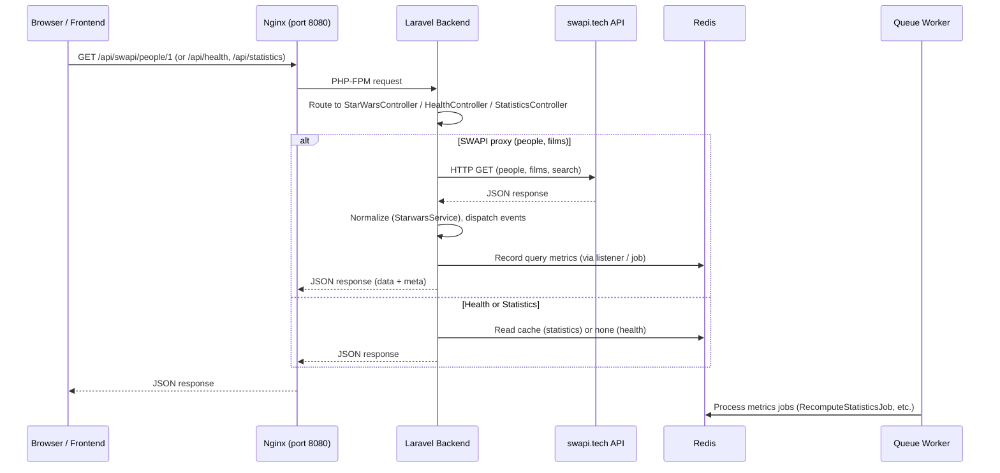
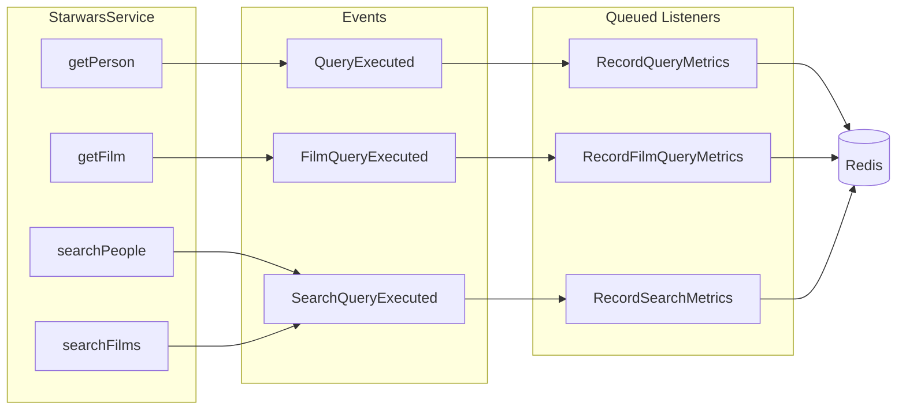

# Backend - SWAPI Proxy API

PHP 8.4 + Laravel 12 API-only application that proxies the Star Wars API (swapi.tech), provides search with pagination, query statistics, and full observability.

## Architecture

### How the API flow works



- **Frontend** (Vite app) calls `/api/*`; in dev this is proxied to the backend (e.g. `localhost:8080`).
- **Nginx** listens on port 8080 and forwards requests to the Laravel backend (PHP-FPM).
- **Backend** serves health and statistics from the app (and Redis); people/films requests are proxied to **swapi.tech**, normalized, then returned. Metrics are written to **Redis** and processed asynchronously by **Queue Worker** (RabbitMQ).

### Layer Responsibilities

| Layer          | Responsibility                                           |
| -------------- | -------------------------------------------------------- |
| Domain         | DTOs, interfaces, exceptions. No framework dependencies. |
| Application    | Services, events, listeners, jobs. Orchestration layer.  |
| Http           | Controllers, middleware, responses. HTTP-specific I/O.   |
| Infrastructure | Gateways, repositories, logging. External integrations.  |

### Folder Structure

```
app/
├── Domain/                         # Pure domain logic (no framework deps)
│   ├── Contracts/
│   │   └── AppLoggerInterface      # On-demand logger interface
│   ├── Swapi/
│   │   ├── Contracts/              # SwapiClientInterface
│   │   ├── DTOs/                   # PersonDto, FilmDto, PaginatedResultDto
│   │   └── Exceptions/             # SwapiNotFoundException, SwapiUnavailableException
│   └── Statistics/
│       ├── Contracts/              # QueryLogRepositoryInterface
│       └── DTOs/                   # QueryStatisticsDto
├── Application/                    # Use cases & orchestration
│   ├── Services/                   # StarwarsService, StatisticsService
│   ├── Events/                     # QueryExecuted, FilmQueryExecuted, SearchQueryExecuted
│   ├── Listeners/                  # RecordQueryMetrics, RecordFilmQueryMetrics, RecordSearchMetrics (queued)
│   ├── Jobs/                       # RecomputeStatisticsJob
│   └── Console/Commands/           # ComputeStatisticsCommand
├── Http/                           # HTTP layer
│   ├── Controllers/                # HealthController, StarWarsController, StatisticsController, SwaggerController
│   ├── Middleware/                  # RequestLogMiddleware
│   └── Responses/                  # ApiResponse (standard + paginated)
├── Infrastructure/                 # Framework & external integrations
│   ├── Clients/
│   │   ├── BaseHttpClient          # Shared HTTP client with retry logic
│   │   ├── CircuitBreaker          # Redis-backed circuit breaker
│   │   └── Swapi/
│   │       ├── SwapiHttpClients    # SWAPI HTTP gateway implementation
│   │       └── SwapiResponseWrapper# SWAPI response parser with pagination metadata
│   ├── Logging/
│   │   └── LaravelAppLogger        # AppLoggerInterface implementation (Monolog)
│   └── Repositories/
│       └── RedisQueryLogRepository # Query/search statistics storage
└── Providers/
    └── AppServiceProvider           # Interface bindings & event wiring
```

## API Endpoints

### GET /api/health

Returns service health status.

**Response 200:**

```json
{ "status": "ok" }
```

### GET /api/swapi/people?name={query}

Searches for Star Wars people. Supports pagination and optional name filtering.

**Parameters:**

- `name` (query, string, optional) - Filter people by name

**Response 200:**

```json
{
    "data": [
        {
            "id": 1,
            "name": "Luke Skywalker",
            "height": "172",
            "mass": "77",
            "birth_year": "19BBY",
            "gender": "male"
        }
    ],
    "meta": {
        "current_page": 1,
        "total_pages": 9,
        "total_records": 82,
        "has_next_page": true
    }
}
```

### GET /api/swapi/people/{id}

Fetches a single Star Wars person by ID.

**Parameters:**

- `id` (path, integer, min: 1) - The SWAPI person ID

**Response 200:**

```json
{
    "data": {
        "id": 1,
        "name": "Luke Skywalker",
        "height": "172",
        "mass": "77",
        "birth_year": "19BBY",
        "gender": "male"
    }
}
```

### GET /api/swapi/films?name={query}

Searches for Star Wars films. Supports pagination and optional name filtering.

**Parameters:**

- `name` (query, string, optional) - Filter films by title

**Response 200:**

```json
{
    "data": [
        {
            "id": 1,
            "title": "A New Hope",
            "episode_id": 4,
            "director": "George Lucas",
            "release_date": "1977-05-25"
        }
    ],
    "meta": {
        "current_page": 1,
        "total_pages": 1,
        "total_records": 6,
        "has_next_page": false
    }
}
```

### GET /api/statistics

Returns query statistics, recomputed every 5 minutes.

**Response 200:**

```json
{
    "data": {
        "top_search_queries": [
            { "search_type": "person", "count": 42, "percentage": 35.0 }
        ],
        "average_response_time_ms": 150.25,
        "popular_hours": { "0": 5, "1": 3, "14": 28 },
        "total_queries": 120,
        "computed_at": "2026-01-15T10:30:00+00:00"
    }
}
```

**Error Responses (all endpoints):**

| HTTP Status | When                           |
| ----------- | ------------------------------ |
| 404         | Person/resource not found      |
| 422         | Invalid request parameters     |
| 502         | SWAPI connection/request error |

All errors follow **RFC 9457 Problem Details** format:

```json
{
    "type": "https://httpstatuses.com/{status}",
    "title": "Human-readable title",
    "status": 422,
    "detail": "Detailed error description",
    "errors": {}
}
```

---

## Observability

The application has three observability layers: **request logging**, **application logging**, and **exception reporting**.

### 1. Request Logging (Middleware)

Every API request is automatically logged by `RequestLogMiddleware`, which is registered globally on the `api` middleware group in `bootstrap/app.php`.

Each log entry (written to `storage/logs/requests.log` via the `request` log channel) includes:

| Field         | Description                   |
| ------------- | ----------------------------- |
| `method`      | HTTP method (GET, POST, etc.) |
| `uri`         | Full request URI with query   |
| `path`        | Request path                  |
| `ip`          | Client IP address             |
| `status`      | Response HTTP status code     |
| `duration_ms` | Total request duration (ms)   |

### 2. Application Logger (On-demand)

An injectable `AppLoggerInterface` (bound to `LaravelAppLogger`) is available for on-demand logging throughout the codebase. It provides `info`, `error`, `warning`, and `debug` methods, all routed to the default `stack` log channel (`storage/logs/laravel.log`).

Usage example:

```php
public function __construct(
    private readonly AppLoggerInterface $logger,
) {}

public function doSomething(): void
{
    $this->logger->info('Operation started', ['key' => 'value']);
    $this->logger->error('Something failed', ['error' => $e->getMessage()]);
}
```

The logger is already injected into `StarwarsService` and `SwapiHttpClients` (the SWAPI gateway), logging HTTP calls, response times, and errors.

### 3. Exception Reporting

All uncaught exceptions are reported via `bootstrap/app.php`'s `withExceptions` block. Each caught exception is logged to `Log::error()` with:

- Exception class name
- File and line number
- Full stack trace

---

## Redis Usage

Redis serves three purposes in this application:

### 1. Query & Search Statistics

All detail and search queries are recorded in Redis for analytics.

| Key                   | Type       | Purpose                                |
| --------------------- | ---------- | -------------------------------------- |
| `swapi:query_log`     | List       | JSON entries for person detail queries |
| `swapi:query_counts`  | Sorted Set | Person ID -> detail query count        |
| `swapi:search_log`    | List       | JSON entries for search queries        |
| `swapi:search_counts` | Sorted Set | `{type}:{query}` -> search query count |
| `swapi:statistics`    | String     | Cached computed statistics (TTL 6 min) |

**Detail query log entry:**

```json
{
    "person_id": 1,
    "response_time_ms": 142.5,
    "timestamp": "2026-02-13T10:30:00+00:00",
    "hour": 10
}
```

**Search query log entry:**

```json
{
    "search_type": "people",
    "query": "luke",
    "response_time_ms": 320.1,
    "result_count": 3,
    "timestamp": "2026-02-13T10:30:00+00:00",
    "hour": 10
}
```

### 2. Circuit Breaker State

The `CircuitBreaker` class stores its state in Redis keys prefixed with `swapi:circuit`, tracking failure counts and state transitions (closed -> open -> half-open) to protect the application from cascading failures when SWAPI is unavailable.

### 3. Queue Backend

Redis also serves as the queue driver (configurable via `QUEUE_CONNECTION`), used by RabbitMQ-compatible listeners to process jobs asynchronously.

---

## RabbitMQ / Queue Usage

The application uses Laravel's event-driven architecture with **queued listeners** to process statistics asynchronously, decoupling the API response from the metrics recording. Events are dispatched by `StarwarsService` and listeners are registered in `AppServiceProvider::boot()`.

### Flow



- **getPerson(id)** → dispatches `QueryExecuted` (personId, responseTimeMs) → **RecordQueryMetrics** → Redis.
- **getFilm(id)** → dispatches `FilmQueryExecuted` (filmId, responseTimeMs) → **RecordFilmQueryMetrics** → Redis.
- **searchPeople(params)** / **searchFilms(params)** → dispatch `SearchQueryExecuted` (searchType, query, responseTimeMs, resultCount) → **RecordSearchMetrics** → Redis.

All three listeners implement `ShouldQueue`; jobs are processed by the queue worker (RabbitMQ), so the HTTP response is not blocked by metrics writes.

### Events

| Event                 | Dispatched when               | Payload                                                |
| --------------------- | ----------------------------- | ------------------------------------------------------ |
| `QueryExecuted`       | Person detail fetched by ID   | `personId`, `responseTimeMs`                           |
| `FilmQueryExecuted`   | Film detail fetched by ID    | `filmId`, `responseTimeMs`                             |
| `SearchQueryExecuted` | People or films search run   | `searchType`, `query`, `responseTimeMs`, `resultCount` |

### Listeners

| Listener                 | Handles               | Action                                  |
| ------------------------ | --------------------- | --------------------------------------- |
| `RecordQueryMetrics`     | `QueryExecuted`       | `recordQuery(personId, responseTimeMs)` |
| `RecordFilmQueryMetrics` | `FilmQueryExecuted`   | `recordFilmQuery(filmId, responseTimeMs)` |
| `RecordSearchMetrics`    | `SearchQueryExecuted` | `recordSearchQuery(searchType, query, responseTimeMs, resultCount)` |

## Testing

Tests use **Pest** (PHPUnit wrapper) with shared mocks in `tests/Mocks/` and are split into:

- **Unit** (`tests/Unit/`): Application (services, commands, listeners, jobs), Domain (DTOs), Infrastructure (CircuitBreaker, RedisQueryLogRepository, SwapiResponseWrapper), Http (ApiResponse, controllers, middleware). Dependencies are mocked.
- **Feature** (`tests/Feature/`): HTTP integration by endpoint (API root, health, Swagger, SwAPI people/films, statistics). Real routes are called; external boundaries (e.g. `SwapiClientInterface`, `QueryLogRepositoryInterface`) are mocked.

```bash
# Run all tests
docker compose exec backend php artisan test

# Run unit or feature only
docker compose exec backend php artisan test tests/Unit
docker compose exec backend php artisan test tests/Feature
```

### Code coverage

The backend image includes the PCOV extension for code coverage. Rebuild the image if you get "Code coverage driver not available":

```bash
docker compose build backend
```


Generate a coverage report:

```bash
docker compose exec backend php artisan test --coverage
```

HTML report is written to `build/coverage/html/` (see `phpunit.xml` `<source>`). The `build/` directory is in `.gitignore`.

## Configuration

Key environment variables (see `.env.example`):

| Variable                          | Default                      | Description                        |
| --------------------------------- | ---------------------------- | ---------------------------------- |
| `REDIS_HOST`                      | `redis`                      | Redis hostname                     |
| `CACHE_STORE`                     | `redis`                      | Cache driver                       |
| `QUEUE_CONNECTION`                | `redis`                      | Queue driver (RabbitMQ-compatible) |
| `SWAPI_BASE_URL`                  | `https://www.swapi.tech/api` | SWAPI base URL                     |
| `SWAPI_TIMEOUT`                   | `5`                          | HTTP timeout (seconds)             |
| `SWAPI_RETRY_TIMES`               | `2`                          | Number of retries                  |
| `SWAPI_CIRCUIT_FAILURE_THRESHOLD` | `5`                          | Failures before circuit opens      |
| `SWAPI_CIRCUIT_TIMEOUT_SECONDS`   | `60`                         | Seconds before circuit half-opens  |
| `STATISTICS_QUERY_LOG_KEY`        | `swapi:query_log`            | Redis key for detail query log     |
| `STATISTICS_QUERY_COUNTS_KEY`     | `swapi:query_counts`         | Redis key for detail query counts  |
| `STATISTICS_SEARCH_LOG_KEY`       | `swapi:search_log`           | Redis key for search query log     |
| `STATISTICS_SEARCH_COUNTS_KEY`    | `swapi:search_counts`        | Redis key for search query counts  |
| `STATISTICS_CACHE_KEY`            | `swapi:statistics`           | Redis key for cached statistics    |
| `STATISTICS_CACHE_TTL`            | `360`                        | Statistics cache TTL (seconds)     |

## OpenAPI Specification

The API specification is available at `docs/openapi.yaml` and can be viewed with any OpenAPI-compatible tool (Swagger UI, Redocly, etc.).

**Swagger UI** is available at `/api/docs` when the backend is running (e.g. `http://localhost:8080/api/docs`).
