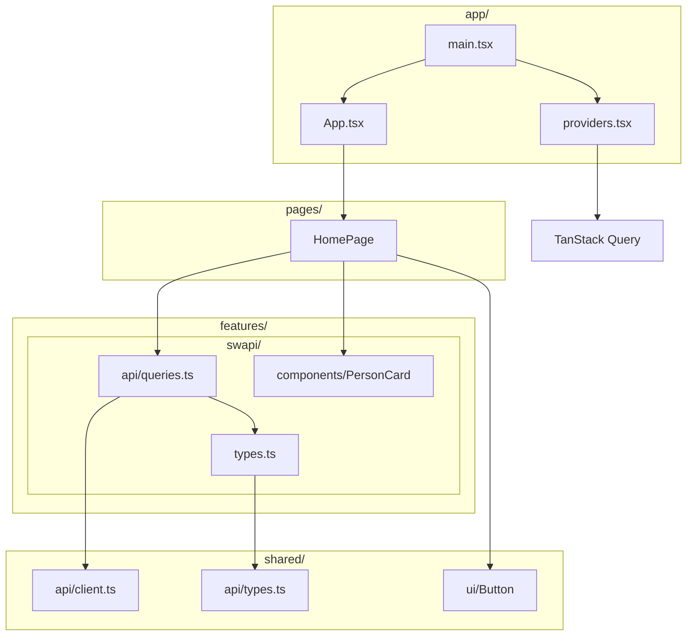

# Frontend - SWAPI Proxy UI

React 19 + TypeScript + Vite single-page application that consumes the SWAPI Proxy backend API.

## Architecture

The frontend follows a **feature-based module structure** with clear dependency boundaries.



### Module Boundaries

| Module     | Responsibility                                    | May Import From    |
|------------|---------------------------------------------------|--------------------|
| `app/`     | Bootstrap, root component, providers              | pages, shared      |
| `pages/`   | Route-level components (page composition)         | features, shared   |
| `features/`| Feature modules (components, hooks, API calls)    | shared             |
| `shared/`  | Reusable UI, API client, utilities, types         | Nothing internal   |

### Folder Structure

```
src/
├── app/                        # Application bootstrap
│   ├── main.tsx                # Entry point
│   ├── App.tsx                 # Root component
│   ├── App.css                 # Global styles
│   └── providers.tsx           # QueryClientProvider
├── shared/                     # Shared utilities and UI
│   ├── api/
│   │   ├── client.ts           # Typed fetch wrapper
│   │   └── types.ts            # API response contracts
│   └── ui/
│       └── Button.tsx          # Reusable button component
├── features/                   # Feature modules
│   └── swapi/
│       ├── api/
│       │   └── queries.ts      # TanStack Query hooks
│       ├── components/
│       │   └── PersonCard.tsx   # Person display component
│       └── types.ts            # Feature-specific types
├── pages/                      # Route-level pages
│   └── HomePage.tsx
└── __tests__/                  # Test files
    ├── setup.ts
    └── App.test.tsx
```

## Why TanStack Query?

We chose [TanStack Query](https://tanstack.com/query) over a plain fetch wrapper because:

1. **Built-in caching** - Responses are cached and deduplicated automatically
2. **Loading/error states** - `isLoading`, `isError`, `data` out of the box
3. **Stale-while-revalidate** - Shows cached data while refetching in background
4. **Query invalidation** - Easy to refresh data when needed
5. **DevTools** - Optional but powerful debugging tools
6. **De-facto standard** - Most popular server state library for React

The API client (`shared/api/client.ts`) is a thin typed wrapper around `fetch` that TanStack Query calls internally. This keeps the actual HTTP logic minimal while letting TanStack Query manage the async lifecycle.

## Development

The Vite dev server runs on port 5173 and proxies `/api/*` requests to the backend nginx container:

```
Browser -> http://localhost:5173 -> Vite Dev Server
Browser -> http://localhost:5173/api/* -> nginx:80 -> php-fpm
```

This avoids any CORS configuration in development.

## Scripts

```bash
# Start dev server
npm run dev

# Build for production
npm run build

# Run tests
npm run test        # watch mode
npm run test:run    # single run

# Lint
npm run lint

# Format
npm run format          # write
npm run format:check    # check only
```

## Testing

Tests use **Vitest** + **React Testing Library**.

```bash
# Run tests in the container
docker compose exec frontend npm run test -- --run

# Watch mode (interactive)
docker compose exec frontend npm run test
```

## Code Quality

| Tool       | Config File          | Purpose                |
|------------|----------------------|------------------------|
| TypeScript | `tsconfig.app.json`  | Strict type checking   |
| ESLint     | `eslint.config.js`   | Code linting           |
| Prettier   | `.prettierrc`        | Code formatting        |
| Vitest     | `vite.config.ts`     | Test runner            |
